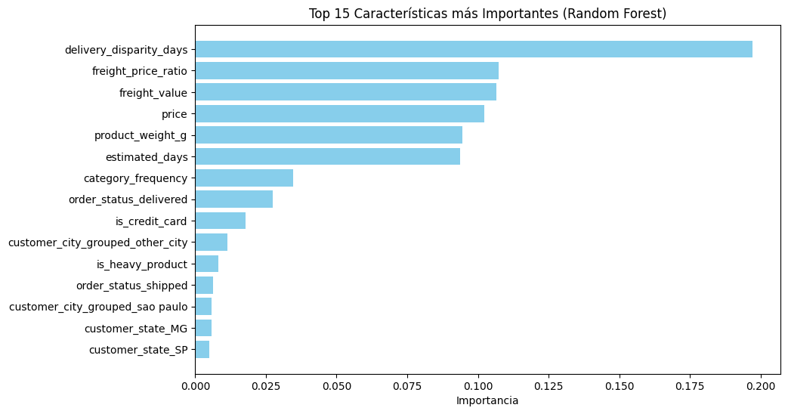
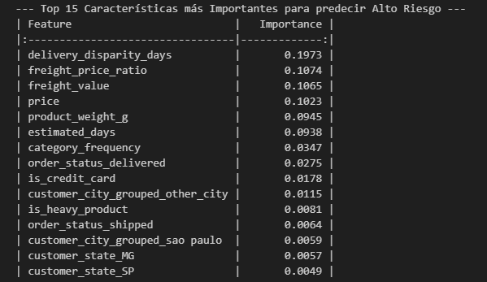
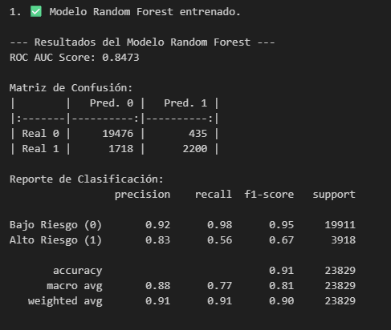

# 🚀 Early Warning System for Customer Dissatisfaction (Olist E-commerce)

## 🎯 Project Overview
This project establishes a **Predictive Framework** to identify customer dissatisfaction and operational risks in the Olist ecosystem, Brazil's largest marketplace. By integrating **9 relational datasets** and analyzing over **100,000 orders**, I developed a system that transforms raw commercial data into **proactive business intelligence**.

## 📊 Data Science & Engineering
The core value of this project is the **Data Engineering pipeline** built in VS Code, which consolidates multiple business dimensions: Logistics, Payments, and Customer Sentiment.

### 🧠 Feature Engineering & Business Insights
The model's success relies on custom metrics. Through **Random Forest Feature Importance** analysis, I identified that logistical performance, rather than just price, is the primary driver of risk:

| Feature | Importance | Business Insight |
| :--- | :--- | :--- |
| **delivery_disparity_days** | **0.1973** | The delta between promised and actual delivery is the #1 risk driver. |
| **freight_price_ratio** | **0.1074** | High shipping costs relative to product price correlate with dissatisfaction. |
| **freight_value** | **0.1065** | Absolute shipping cost is a significant friction point. |

## 📈 Model Performance
The Random Forest classifier was chosen as the champion model for its high precision and discriminative power.

### Key Metrics:
* **ROC AUC Score:** `0.8473` (High reliability)
* **High-Risk Precision:** `0.83` (83% of predicted high-risk cases are accurate)
* **Overall Accuracy:** `0.91`

### Confusion Matrix
| | Pred. Low Risk | Pred. High Risk |
| :--- | :--- | :--- |
| **Real Low Risk** | 19,476 | 435 |
| **Real High Risk** | 1,718 | 2,200 |

> **Operational Impact:** The model is exceptionally good at avoiding "false alarms" (only 435 false positives out of 23,829 samples), ensuring that retention efforts are focused on truly frustrated customers.

## 📦 Deployment Ready
Serialized assets are provided in the `/models` directory for production integration:
* `rf_best_model.joblib`: Optimized Random Forest Classifier. 
* `scaler.joblib`: Pre-fitted standardizer for consistent data preprocessing.

**Note:** The final Random Forest model (263MB) is not included in the repository due to GitHub storage limits. However, the full training pipeline is available in the notebook to reproduce the results.

## 💰 Business ROI
1.  **Churn Mitigation:** Proactively intervene with the 83% accurately identified high-risk customers.
2.  **Logistics Strategy:** Prioritize reducing the "Delivery Disparity" gap to increase Customer Lifetime Value (CLV).

## 🎯 Project Vision
This project establishes a **Predictive Framework** to identify customer dissatisfaction and operational risks in the Olist ecosystem, Brazil's largest marketplace department store. By integrating **9 relational datasets** and analyzing over **100,000 orders**, I developed a system that moves beyond simple analytics into **proactive business intervention**.

## 📊 The Dataset: A Relational Challenge
The project is built upon real-world commercial data from Olist. The integration process involved consolidating information from orders, payments, reviews, and logistics.

🔗 **Dataset Source:** [Kaggle - Brazilian E-Commerce Public Dataset by Olist](https://www.kaggle.com/datasets/olistbr/brazilian-ecommerce)

> **Note:** Due to storage optimization practices (120MB raw data), the CSV files are not included in this repository. The `ecommerce.ipynb` notebook contains the full engineering pipeline to reproduce the dataset.
